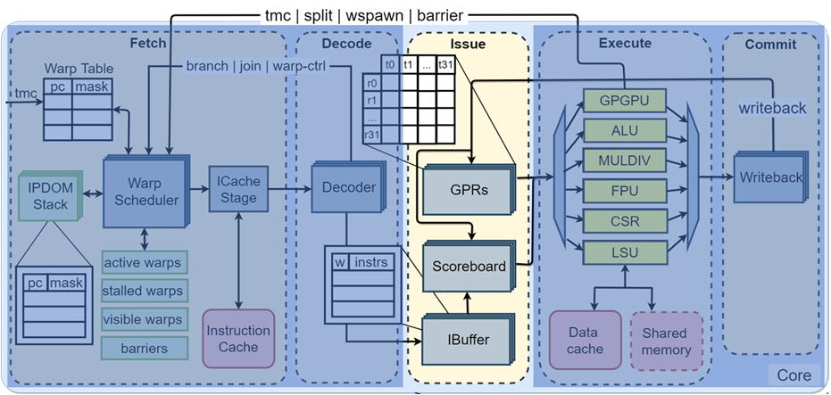

# Project Name: RAIV GPGPU C-Modelling
  The goal of this project is to implementa a detailed model for the RAIV GPGPU using C.
  
  
# Table of Contents:

- [Introduction](#introduction)
- [Description](#description)
- [List of Files](#list-of-files)
- [APIs](#APIs)
- [Revision](#revision)
- [Contributors](#contributors)
- [Acknowledgments](#acknowledgments)
- [Sponsors](#sponsors)
- [Release History](#release-history)

# Introduction
- **Issue Stage**
  - Scheduling
    - In-order issue (operands/execute unit ready), out-of-order commit
  - IBuffer
    - Store fetched instructions, separate queues per-warp, selects next warp through round-robin scheduling
  - Scoreboard
    - Track in-use registers
  - GPRs (General-Purpose Registers) stage
    - Fetch issued instruction operands and send operands to execute unit



# Description:
- Development of high level C model for commit stage in RAIV GPGPU.
- each block is represented as a void function: its input and output interfaces are passed as a struct arguments.
- there is printf function per each struct to print the itmes values of it.
- there is assignment function per each needed structs to be assign.

# List of Files:
- README.md: This file.  
- Source Files:
  - GPRs.c: Implenentation of general purpose registers functions. 
  - assign_structs.c: asssign struct's data using another struct's data.   
  - common.c: Common Functions implenentation, used in raiv model.  
  - decoder.c: Implenentation of decoder functions.  
  - dispatch.c: Implenentation of dispatch unit.  
  - gpgpu.c: Implenentation of GPGPU unit.  
  - ibuffer.c: Implenentation of instruction buffer unit.     
  - issue_stage.c: Implenentation of issue stage functions.  
  - print_struct.c: Printing data of every used struct.  
  - scoreboard.c: Implenentation of scoreboard unit.   
  - raiv_core.c: The main code of the stage
  
- Header Files:
  - decoder.h: Header for decoder functions.
  - gpgpu.h: Header of GPGPU unit.
  - issue_stage.h: Header for issue stage functions.   
  - config.h: It contain macro definitions for GPGPU configurations.
  - common.h: Common Functions header, used in raiv model.
  - define.h: Definition header, used in raiv model.
# APIs:
## Functions
```c
void 	issue_stage (VX_decode 	     decode, 
		     VX_writeback *  writeback,
		     VX_alu_req  *   alu_req,
		     VX_lsu_req  *   lsu_req,
		     VX_csr_req  *   csr_req,
		     VX_fpu_req  *   fpu_req,
		     VX_gpu_req  *   gpu_req) 
				 
```
This function model RAIV issue stage
- ***Returns*** : Void  
- ***Reference***: [issue_stage.c](./issue_stage.c) , [issue_stage.h](./issue_stage.h) 
- ***Parameters***:

|  Name  	|                   Description                   	|
|:------:	|:-----------------------------------------------:	|
| `decode` 	| decoder input signal  |
| `writeback` 	| writeback stage input signal 	|
| `alu_req` 	|  instruction and data which out to ALU unit 	|
| `lsu_req` 	|  instruction and data which out to LSU unit 	|
| `csr_req` 	|  instruction and data which out to CSR unit 	|
| `fpu_req` 	|  instruction and data which out to FPU unit 	|
| `gpu_req` 	|  instruction and data which out to GPU unit 	|
----
```c
void ibuffer_stage (VX_decode   decode,
		    VX_decode  *ibuffer,
		    bool 	write_ibuffer,
		    bool 	read_ibuffer) 
```
This function extend an input value caring about sign  
- ***Returns*** : Void 
- ***Reference***: [ibuffer.c](./ibuffer.c) , [issue_stage.h](./issue_stage.h) 
- ***Parameters***:

|  Name  	|                   Description                   	|
|:------:	|:-----------------------------------------------:	|
| `decode` 	| decoder input signal  |
| `ibuffer` 	| ibuffer output signal 	|
| `write_ibuffer` 	|  input write enable in ibuffer 	|
| `read_ibuffer` 	|  input read enable from ibuffer 	|
----
```c
void gpr_stage (VX_writeback  VX_writeback, 
		VX_gpr_req    gpr_req, 
		VX_gpr_rsp   *gpr_rsp  ) 
```
This function model RAIV decoder stage
- ***Returns*** : Void  
- ***Reference***: [GPRs.c](./GPRs.c) , [issue_stage.h](./issue_stage.h) 
- ***Parameters***:

|  Name  	|                   Description                   	|
|:------:	|:-----------------------------------------------:	|
| `VX_writeback` 	| writeback stage input signal 	|
| `gpr_req` 	| input address to GPRs 	|
| `gpr_rsp` 	| output data from GPRs 	|
----
```c
void scoreboard (VX_decode 	ibuffer, 
		VX_writeback 	writeback, 
		bool 	       *read_ibuffer  ) 
```
This function model RAIV decoder stage
- ***Returns*** : Void  
- ***Reference***: [scoreboard.c](./scoreboard.c) , [issue_stage.h](./issue_stage.h) 
- ***Parameters***:

|  Name  	|                   Description                   	|
|:------:	|:-----------------------------------------------:	|
| `VX_writeback` 	| writeback stage input signal 	|
| `ibuffer` 	| ibuffer input signal 	|
| `read_ibuffer` 	| output read enable to instruction buffer 	|
----
```c
 void dispatch  (VX_decode 	ibuffer,  
 		 bool	       *read_ibuffer, 
		 VX_gpr_rsp 	gpr_rsp,
		 VX_alu_req    *alu_req, 
		 VX_lsu_req    *lsu_req, 
		 VX_csr_req    *csr_req,
		 VX_fpu_req    *fpu_req, 
		 VX_gpu_req    *gpu_req)
```
This function model RAIV decoder stage
- ***Returns*** : Void  
- ***Reference***: [dispatch.c](./dispatch.c) , [issue_stage.h](./issue_stage.h) 
- ***Parameters***:

|  Name  	|                   Description                   	|
|:------:	|:-----------------------------------------------:	|
| `ibuffer` 	| ibuffer input signal  |
| `read_ibuffer` 	| output read enable to ibuffer 	|
| `gpr_rsp` 	| input data from GPRs 	|
| `alu_req` 	|  instruction and data which out to ALU unit 	|
| `lsu_req` 	|  instruction and data which out to LSU unit 	|
| `csr_req` 	|  instruction and data which out to CSR unit 	|
| `fpu_req` 	|  instruction and data which out to FPU unit 	|
| `gpu_req` 	|  instruction and data which out to GPU unit 	|

----
## Type defs

### VX_writeback

- ***Reference***: [issue_stage.c](./issue_stage.c) , [issue_stage.h](./issue_stage.h) 
- ***members***:

|  Name  	|                   Size                   	|
|:------:	|:---------------------------------------:	|
| `uuid` 	| UUID_BITS 	|
| `tmask` 	| NUM_THREADS 	|
| `wid` 	| NW_BITS  	|
| `rd` 	|  NR_BITS  	|
| `data` 	| [NUM_THREADS]   	|
| `pc` 	| 32   	|
| `eop` 	| 1 	|
----

### VX_gpr_req

- ***Reference***: [issue_stage.c](./issue_stage.c) , [issue_stage.h](./issue_stage.h) 
- ***members***:

|  Name  	|                   Size                   	|
|:------:	|:---------------------------------------:	|
| `wid` 	| NW_BITS 	|
| `rs1` 	| NW_BITS 	|
| `rs2` 	| NW_BITS  	|
| `rs3` 	|  NW_BITS  	|
----

### VX_gpr_rsp

- ***Reference***: [issue_stage.c](./issue_stage.c) , [issue_stage.h](./issue_stage.h) 
- ***members***:

|  Name  	|                   Size                   	|
|:------:	|:---------------------------------------:	|
| `rs1_data` 	| [NUM_THREADS] 	|
| `rs2_data` 	| [NUM_THREADS] 	|
| `rs3_data` 	| [NUM_THREADS]  	|
----

### VX_alu_req

- ***Reference***: [issue_stage.c](./issue_stage.c) , [issue_stage.h](./issue_stage.h) 
- ***members***:

|  Name  	|                   Size                   	|
|:------:	|:---------------------------------------:	|
| `uuid` 	| UUID_BITS 	|
| `tmask` 	| NUM_THREADS 	|
| `wid` 	| NW_BITS  	|
| `pc` 	| 32   	|
| `next_PC` 	| 32   	|
| `op_type ` 	| INST_ALU_BITS   	|
| `op_mod ` 	| INST_MOD_BITS   	|
| `use_PC` 	| 1 	|
| `use_imm` 	| 1 	|
| `imm` 	| 32 	|
| `tid ` 	| NT_BITS 	|
| `rs1_data` 	| [NUM_THREADS]   	|
| `rs2_data` 	| [NUM_THREADS]   	|
| `rd` 	|  NR_BITS  	|
| `wb` 	| 1 	|
----

### VX_lsu_req

- ***Reference***: [issue_stage.c](./issue_stage.c) , [issue_stage.h](./issue_stage.h) 
- ***members***:

|  Name  	|                   Size                   	|
|:------:	|:---------------------------------------:	|
| `uuid` 	| UUID_BITS 	|
| `is_fence` 	| 1 	|
| `is_prefetch` 	| 1 	|
| `tmask` 	| NUM_THREADS 	|
| `wid` 	| NW_BITS  	|
| `pc` 	| 32   	|
| `offset` 	| 32   	|
| `op_type ` 	| INST_LSU_BITS   	|
| `store_data` 	| [NUM_THREADS]   	|
| `base_addr` 	| [NUM_THREADS]   	|
| `rd` 	|  NR_BITS  	|
| `wb` 	| 1 	|
----
### VX_csr_req

- ***Reference***: [issue_stage.c](./issue_stage.c) , [issue_stage.h](./issue_stage.h) 
- ***members***:

|  Name  	|                   Size                   	|
|:------:	|:---------------------------------------:	|
| `uuid` 	| UUID_BITS 	|
| `tmask` 	| NUM_THREADS 	|
| `wid` 	| NW_BITS  	|
| `pc` 	| 32   	|
| `op_type ` 	| INST_CSR_BITS   	|
| `addr  ` 	| CSR_ADDR_BITS   	|
| `use_imm` 	| 1 	|
| `imm` 	| 32 	|
| `rs1_data` 	| 32   	|
| `rd` 	|  NR_BITS  	|
| `wb` 	| 1 	|
----
### VX_fpu_req

- ***Reference***: [issue_stage.c](./issue_stage.c) , [issue_stage.h](./issue_stage.h) 
- ***members***:

|  Name  	|                   Size                   	|
|:------:	|:---------------------------------------:	|
| `uuid` 	| UUID_BITS 	|
| `tmask` 	| NUM_THREADS 	|
| `wid` 	| NW_BITS  	|
| `pc` 	| 32   	|
| `next_PC` 	| 32   	|
| `op_type ` 	| INST_FPU_BITS   	|
| `op_mod ` 	| INST_MOD_BITS   	|
| `rs1_data` 	| [NUM_THREADS]   	|
| `rs2_data` 	| [NUM_THREADS]   	|
| `rs3_data` 	| [NUM_THREADS]   	|
| `rd` 	|  NR_BITS  	|
| `wb` 	| 1 	|
----
### VX_gpu_req

- ***Reference***: [issue_stage.c](./issue_stage.c) , [issue_stage.h](./issue_stage.h) 
- ***members***:

|  Name  	|                   Size                   	|
|:------:	|:---------------------------------------:	|
| `uuid` 	| UUID_BITS 	|
| `tmask` 	| NUM_THREADS 	|
| `wid` 	| NW_BITS  	|
| `pc` 	| 32   	|
| `next_PC` 	| 32   	|
| `op_type ` 	| INST_GPU_BITS   	|
| `op_mod ` 	| INST_MOD_BITS   	|
| `tid ` 	| NT_BITS 	|
| `rs1_data` 	| [NUM_THREADS]   	|
| `rs2_data` 	| [NUM_THREADS]   	|
| `rs3_data` 	| [NUM_THREADS]   	|
| `rd` 	|  NR_BITS  	|
| `wb` 	| 1 	|
----


# How To Use:
  - Running the tests:
  - There is main function that you can run and edit the input of it.

# Revision:
|Date |  Name  |                   Description         |
|:---:|:------:|---------------------------------------|
| 2022.12.25 |`Updates`| Fixing write after write bug and write data correctly. |
| 2022.12.26 |`Updates`| Automating Test environment ( reading input file , call function , read output file and compare result). |
| 2022.12.26 |`Issues` | -- |
| 2022.12.26 |`TODO`   | -- |
----

# Contributors:
  - Designed By: 
    - Ahmed Hany
  - Reviewed By:
    - Mostafa Abdel-Hameed
    - Hossam Hassan  
    
    
# Acknowledgments:
bla bla

# Sponsors:
   [SiliconArts, Inc.](https://www.siliconarts.com/) 
# Release History:
* 0.0.1
    * Work in progress


Extras: https://github.com/adam-p/markdown-here/wiki/Markdown-Cheatsheet


